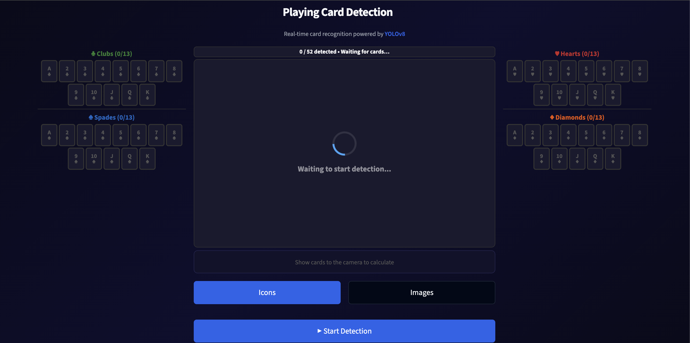
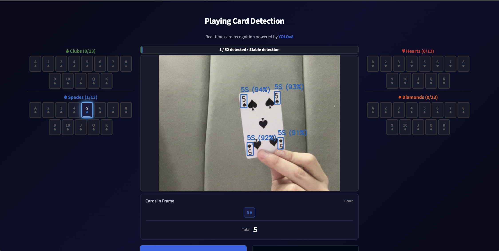
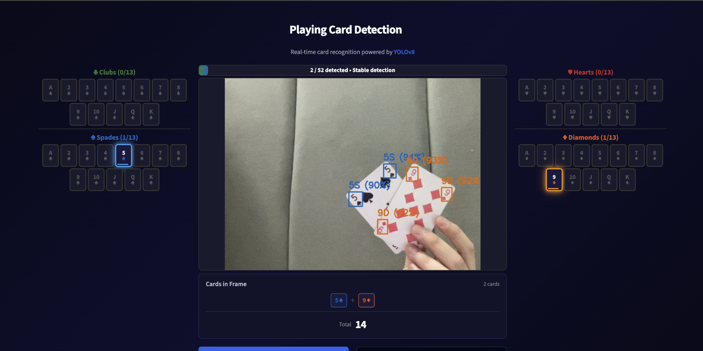
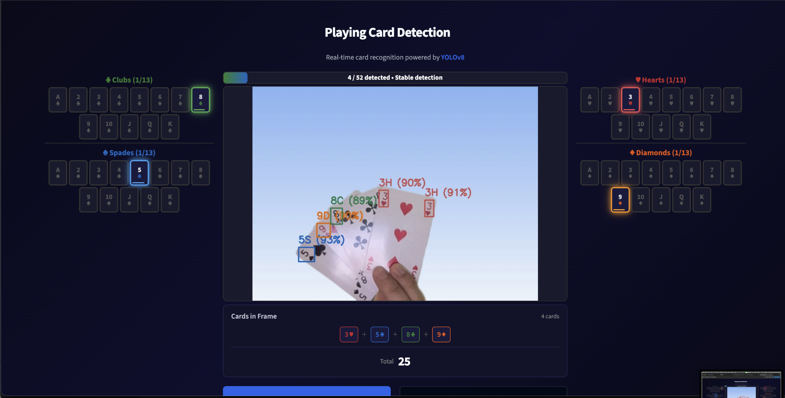

# Playing Card Detection

Real-time playing card recognition system that detects and identifies all 52 standard playing cards through a webcam feed using a custom-trained YOLOv8 object detection model.



## Demo

| 1 Card Detected | 2 Cards Detected | 4 Cards Detected |
|:---:|:---:|:---:|
|  |  |  |

## Features

- **Real-Time Detection** — Live webcam feed with bounding boxes, class labels, and confidence scores drawn per frame
- **52-Card Coverage** — Detects all ranks (A through K) across all four suits (Clubs, Spades, Hearts, Diamonds)
- **Card Value Calculator** — Automatically sums the values of all cards currently in frame
- **Visual Card Tracker** — Interactive grid showing all 52 cards with real-time glow animations for active detections, dimmed states for previously seen cards, and fade-out transitions
- **Dual Display Modes** — Switch between Icons (text symbols) and Images (card PNGs) views
- **Progress Tracking** — Tracks how many of the 52 cards have been detected across the session
- **Confidence Indicators** — Per-card confidence bars and dynamic status messages (stable detection, low confidence warnings)

## Tech Stack

| Technology | Role |
|---|---|
| [YOLOv8](https://docs.ultralytics.com/) | Object detection model (Ultralytics) |
| [Roboflow](https://roboflow.com/) | Dataset sourcing, annotation, and preprocessing |
| [OpenCV](https://opencv.org/) | Webcam capture, frame processing, bounding box rendering |
| [Streamlit](https://streamlit.io/) | Web application framework and UI |
| [Python](https://www.python.org/) | Core language |

## Model

- **Architecture:** YOLOv8 (You Only Look Once, version 8)
- **Dataset:** Playing card dataset sourced from [Roboflow](https://roboflow.com/), containing annotated images of all 52 standard playing cards
- **Classes:** 52 (one per unique rank-suit combination: `AS`, `2H`, `KD`, etc.)
- **Inference Resolution:** 320x320
- **Confidence Threshold:** 85%
- **Weights:** [`playingCards.pt`](https://drive.google.com/file/d/1legDICApW9fu81j77ItmglCI1xQ88QWD/view?usp=sharing) (~70 MB, hosted on Google Drive)

## How It Works

1. **Capture** — OpenCV reads frames from the webcam at 640x480
2. **Detect** — Each frame is passed through the YOLOv8 model for inference
3. **Annotate** — Detected cards are highlighted with color-coded bounding boxes (green for Clubs, blue for Spades, red for Hearts, orange for Diamonds)
4. **Track** — Detection history is maintained with fade-out animations and session-wide progress tracking
5. **Display** — The Streamlit UI renders everything in real time: camera feed, card grids, progress bar, and value calculator

## Project Structure

```
CardCV/
├── app.py              # Streamlit web application entry point
├── config.py           # Constants (suits, ranks, card values, paths)
├── detection.py        # YOLOv8 model loading and card state management
├── renderer.py         # HTML rendering (card grids, info panels, progress bar)
├── styles.py           # CSS styles (cards, animations, layout)
├── detect.py           # Standalone OpenCV detection script (no UI)
├── requirements.txt    # Python dependencies
├── models/
│   └── playingCards.pt # Trained YOLOv8 model weights (download separately)
└── assets/
    ├── cards/          # 52 card PNG images for the Images display mode
    └── screenshots/    # README screenshots
```

## Getting Started

### Prerequisites

- Python 3.8+
- Webcam

### Installation

```bash
git clone https://github.com/GhandourGh/CardCV.git
cd CardCV
pip install -r requirements.txt
```

### Download Model Weights

The trained YOLOv8 model (~70 MB) is too large for GitHub. Download it from Google Drive and place it in the `models/` directory:

1. **Download** [`playingCards.pt`](https://drive.google.com/file/d/1legDICApW9fu81j77ItmglCI1xQ88QWD/view?usp=sharing)
2. **Move** the file into the project:
   ```bash
   mkdir -p models
   mv ~/Downloads/playingCards.pt models/
   ```

### Run

```bash
streamlit run app.py
```

The app opens in your browser. Click **Start Detection** to activate the webcam and begin recognizing cards.

### Standalone Mode

For a minimal OpenCV-only version without the web UI:

```bash
python detect.py
```

Press `q` to quit.

## License

This project is open source. See [LICENSE](LICENSE) for details.

## Author

Built by [GhandourGh](https://github.com/GhandourGh)
