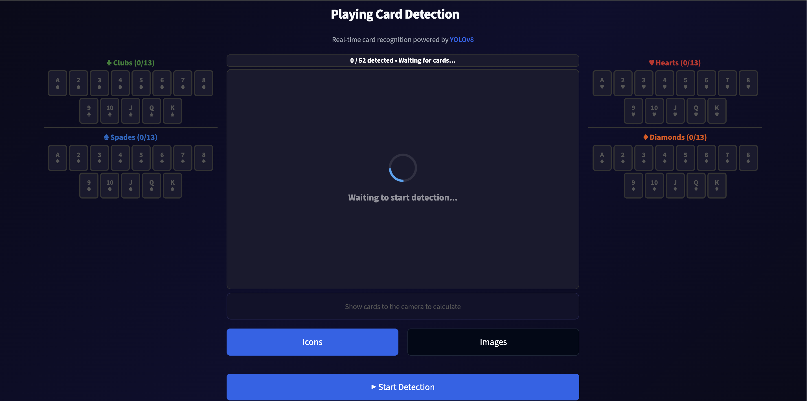
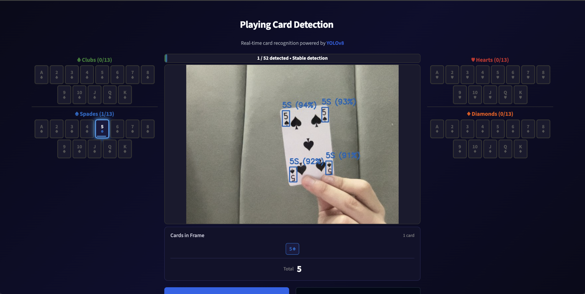
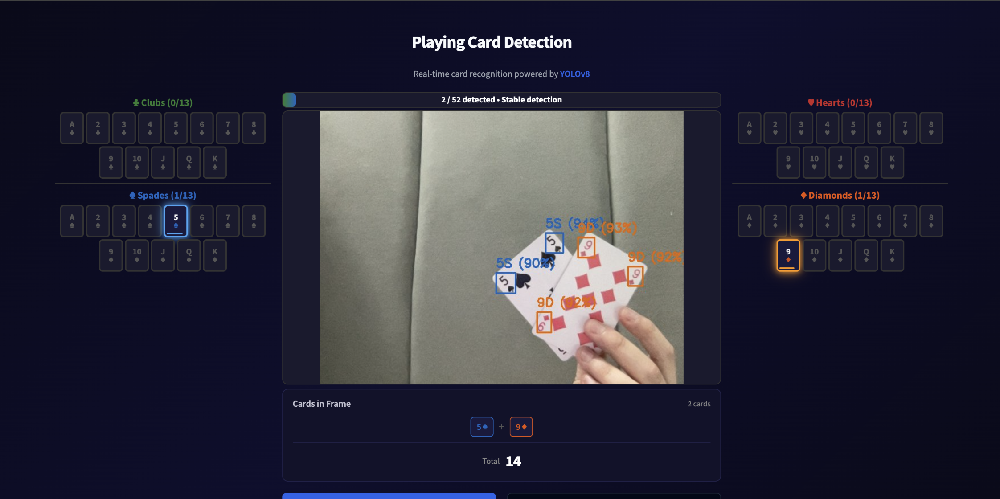
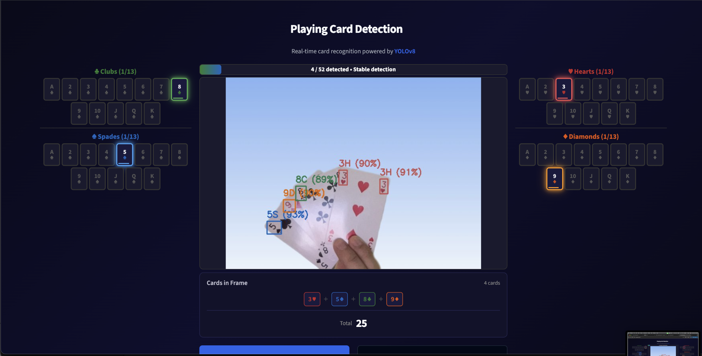

# CardCV — Real-Time Playing Card Detection

Real-time playing card recognition system that detects and identifies all 52 standard playing cards through a webcam feed using a custom-trained YOLOv8 object detection model.



## Demo

| 1 Card Detected | 2 Cards Detected | 4 Cards Detected |
|:---:|:---:|:---:|
|  |  |  |

## Features

- **Real-Time Detection** — Live webcam feed with colour-coded bounding boxes, class labels, and confidence scores
- **52-Card Coverage** — Detects all ranks (A-K) across all four suits (Clubs, Spades, Hearts, Diamonds)
- **Card Value Calculator** — Sums the values of all cards currently visible in the frame
- **Visual Card Tracker** — Interactive grid with glow animations for active detections, dimmed states for previously seen cards, and smooth fade-out transitions
- **Dual Display Modes** — Switch between **Icons** (text symbols) and **Images** (card PNGs)
- **Progress Tracking** — Session-wide counter showing how many of the 52 cards have been detected
- **Confidence Indicators** — Per-card confidence bars and dynamic status messages

## Tech Stack

| Technology | Role |
|---|---|
| [YOLOv8](https://docs.ultralytics.com/) | Object detection model (Ultralytics) |
| [Roboflow](https://roboflow.com/) | Dataset sourcing, annotation, and preprocessing |
| [OpenCV](https://opencv.org/) | Webcam capture, frame processing, bounding-box rendering |
| [Streamlit](https://streamlit.io/) | Web application framework and UI |
| [Python](https://www.python.org/) | Core language |

## Model

| Property | Value |
|---|---|
| Architecture | YOLOv8 (You Only Look Once, v8) |
| Dataset | Playing card dataset from [Roboflow](https://roboflow.com/) — annotated images of all 52 cards |
| Classes | 52 (one per rank-suit combination: `AS`, `2H`, `KD`, etc.) |
| Inference Resolution | 320 x 320 |
| Confidence Threshold | 85% |
| Weights | [`playingCards.pt`](https://drive.google.com/file/d/1legDICApW9fu81j77ItmglCI1xQ88QWD/view?usp=sharing) (~6 MB) |

## How It Works

1. **Capture** — OpenCV reads frames from the webcam at 640 x 480
2. **Detect** — Each frame is passed through YOLOv8 for inference
3. **Annotate** — Detected cards are highlighted with colour-coded bounding boxes (green = Clubs, blue = Spades, red = Hearts, orange = Diamonds)
4. **Track** — Detection history is maintained with fade-out animations and session-wide progress tracking
5. **Display** — Streamlit renders everything in real time: camera feed, card grids, progress bar, and value calculator

## Project Structure

```
CardCV/
├── app.py              # Main Streamlit application
├── config.py           # Paths, suit/rank metadata, animation timings
├── detection.py        # YOLO model loading and card state management
├── renderer.py         # HTML rendering (card grids, info panels, progress bar)
├── styles.py           # CSS styles and animations
├── run_app.py          # Convenience launcher script
├── requirements.txt    # Python dependencies
├── models/
│   └── playingCards.pt # Trained YOLOv8 weights (download separately)
└── assets/
    ├── cards/          # 52 card-face PNG images
    └── screenshots/    # Demo screenshots
```

## Getting Started

### Prerequisites

- Python 3.9+
- Webcam

### Installation

```bash
git clone https://github.com/GhandourGh/CardCV.git
cd CardCV
pip install -r requirements.txt
```

### Download Model Weights

The trained YOLOv8 model is hosted on Google Drive:

1. **Download** [`playingCards.pt`](https://drive.google.com/file/d/1legDICApW9fu81j77ItmglCI1xQ88QWD/view?usp=sharing)
2. **Place** it in the `models/` directory:
   ```bash
   mv ~/Downloads/playingCards.pt models/
   ```

### Run

```bash
python run_app.py
```

Or directly with Streamlit:

```bash
streamlit run app.py
```

The app opens in your default browser. Click **Start Detection** to begin.

## License

This project is open source. See [LICENSE](LICENSE) for details.

## Author

Built by [GhandourGh](https://github.com/GhandourGh)
